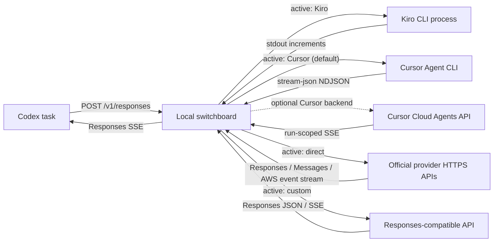

# Codex Provider Switchboard

### A local AI-provider reverse proxy and protocol adapter for Codex

| [Quick start](#quick-start) | [Configuration](https://github.com/qaz553286745/codex-provider-switchboard/blob/main/docs/configuration.md) | [Local API](https://github.com/qaz553286745/codex-provider-switchboard/blob/main/docs/api.md) | [Architecture](https://github.com/qaz553286745/codex-provider-switchboard/blob/main/docs/architecture.md) | [Security](https://github.com/qaz553286745/codex-provider-switchboard/blob/main/SECURITY.md) | [Contributing](https://github.com/qaz553286745/codex-provider-switchboard/blob/main/CONTRIBUTING.md) |
| --- | --- | --- | --- | --- | --- |

[English](https://github.com/qaz553286745/codex-provider-switchboard/blob/main/README.md) |
[简体中文](https://github.com/qaz553286745/codex-provider-switchboard/blob/main/README.zh-CN.md)

A local, OpenAI Responses-compatible reverse proxy and control plane that gives
Codex one stable endpoint while you switch between provider adapters. It is not
a byte-for-byte transparent proxy: it also translates protocols, normalizes
streaming events, and maintains task-to-upstream session affinity.

Today it supports:

- **Kiro CLI** — uses the locally installed and authenticated CLI.
- **Cursor Agent CLI** — the default Cursor path, with real NDJSON streaming
  and resumable local CLI sessions.
- **Cursor Cloud Agents** — retained as an optional API backend.
- **Native direct providers** — Switchboard-owned Python clients for OpenAI API,
  ChatGPT Codex, Anthropic Claude, GitHub Copilot, xAI, OpenRouter, and an
  experimental direct Kiro account path.
- **Custom Responses API** — relays JSON and SSE to a user-configured HTTPS
  endpoint with bearer authentication.

The switchboard translates Responses requests, preserves per-task provider
sessions, and emits Responses SSE events. Provider selection is changed from a
local web control panel; Codex keeps the same base URL.

> [!IMPORTANT]
> This is an independent community adapter. It is not affiliated with,
> endorsed by, or supported by OpenAI, Kiro/AWS, or Cursor. Review each
> provider's terms, security model, and billing before use.

The provider implementation is native to this repository. It does not install
or execute Pi, `@mariozechner/pi-ai`, a Node worker, or a Pi provider plugin.
As an optional migration convenience, a user-triggered importer can read only
Pi's fixed `~/.pi/agent/auth.json` file and copy allow-listed credentials into
Switchboard's own stores. Pi is a credential source, never a runtime dependency.

Billing follows the selected upstream: Kiro requests use the account authenticated
in `kiro-cli`, Cursor requests use the configured Cursor account, and custom-provider
requests use that provider. Codex still orchestrates the task and runs local tools,
but routing model inference through Kiro does not consume OpenAI model quota.

## About

Codex can talk to a custom Responses provider, but Kiro CLI, Cursor CLI, and
Cursor Cloud Agents expose different execution and session models. This project
places a small, auditable adapter between them:



## Highlights

- One fixed local endpoint: `http://127.0.0.1:8787/v1`.
- Real SSE lifecycle events and Codex Responses WebSocket transport: same-lane
  FIFO, parallel named lanes, explicit lane-local cancellation, and bounded
  `previous_response_id` lineage without implicit request cancellation.
- Capability-driven Responses compatibility: native Codex providers retain
  custom tools, `tool_search`, namespaces, multi-agent events, lineage headers,
  and remote compaction; narrower gateways receive reversible function lowering
  instead of provider-specific rewrites scattered across routes.
- Codex-native progress rendering: final answers use `final_answer`, concise
  pre-tool updates use `commentary`, and real `update_plan` calls can drive the
  native step indicator without exposing hidden chain-of-thought.
- Per-task affinity: one Codex task maps to one Kiro session or Cursor agent.
- Subagent isolation: `client_metadata.thread_id` takes precedence, so Codex
  subagents do not share the parent task's provider session.
- Provider-independent subagent loop protection: repeated interrupt/restart
  cycles and status polling terminate locally with a visible final message,
  rather than consuming provider tokens indefinitely.
- Parallel-task routing with isolated workdirs; raise `KIRO_MAX_CONCURRENCY` or
  `CURSOR_CLI_MAX_CONCURRENCY` above the conservative default of `1` to allow
  simultaneous local CLI processes.
- Codex-style tool batching guidance: independent checks use one custom exec
  orchestration call with Promise.all when available, or one permitted batch of
  top-level calls, while dependencies and conflicting writes stay sequential.
- Reasoning fidelity:
  - Codex `max`/`ultra` becomes Kiro `--effort max`.
  - Cursor CLI selects an advertised concrete effort model such as
    `gpt-5.6-sol-max`; Cloud API parameters are selected only from values
    advertised by `GET /v1/models`.
- Local control panel with provider status, model variants, and a content-free
  last-request inspector.
- Live model catalogs from `kiro-cli chat --list-models`,
  `cursor-agent --list-models`, optional Cursor `/v1/models`, or a configurable
  third-party `/models` endpoint. Direct providers use their official catalog
  endpoints where available and a small compatibility catalog otherwise.
- Independent direct-provider credentials: environment variables take priority;
  submitted keys and OAuth refresh tokens are stored separately from ordinary
  settings in an atomic `0600` file. Switchboard never reads or copies
  `~/.codex/auth.json`.
- Preview-first Pi migration: one action can import compatible Kiro, Cursor,
  OpenAI/ChatGPT Codex, Anthropic, GitHub Copilot, xAI, and OpenRouter records
  from the fixed `~/.pi/agent/auth.json` source. Existing credentials are
  skipped unless overwrite is explicitly confirmed; secrets are never echoed.
- Quota cards backed by Kiro `/usage`, Cursor's documented account/agent usage
  boundary, and optional JSON-field mapping for third-party quota endpoints.
- Confirmed Codex config takeover: a timestamped backup plus field-level apply,
  conflict detection, and restore that preserves Codex-managed plugin,
  marketplace, desktop, and other unrelated updates.
- Dashboard agent modes: single-agent (the recommended default), fixed two- or
  four-thread multi-agent limits, and a bounded custom limit. Disabling
  `[agents].enabled` removes only Codex multi-agent tools; ordinary terminal,
  file, browser, and other tool calls remain available.
- Four-MiB absolute Kiro/Cursor prompt bounds with metadata compaction and
  oldest complete-turn trimming. Cursor CLI additionally derives a conservative
  input budget from the advertised 272K/1M context; the active turn is never
  cut, and an unfit request ends with a non-retryable error.
- Kiro context-overflow and bridge-output-truncation statuses are never returned
  as assistant answers. The adapter retries once in a fresh session with a
  768-KiB retained-history cap.
- Kiro responses omit token usage because the CLI does not expose authoritative
  per-run tokens; guessed character counts cannot spuriously trigger Codex
  compaction.
- Bounded gzip, deflate, and zstd decoding for Codex HTTP fallback without
  changing the user's request-compression setting.
- Secret-conscious defaults: loopback binding, atomic `0600` configuration,
  same-origin control mutations, bounded request/output sizes, and redacted,
  size-bounded rotating logs with no prompt or tool payload bodies.

## Requirements

- Python 3.11 or newer.
- [`uv`](https://docs.astral.sh/uv/) for the documented workflow.
- Codex Desktop or Codex CLI.
- For Kiro: `kiro-cli` installed and already authenticated.
- For Cursor: `cursor-agent` installed and a Cursor user API key. The bundled
  Cursor app can install the CLI through `cursor agent`; Cursor also documents
  `curl https://cursor.com/install -fsS | bash`.
- For a custom provider: a Responses-compatible HTTPS endpoint and API key.
- For direct providers: the selected platform's API key or interactive account
  login. API-key OpenAI, Anthropic, xAI, and OpenRouter paths are the preferred
  stable choices; subscription OAuth adapters and direct Kiro are explicitly
  experimental.
- Pi is optional. If it already contains compatible accounts, the dashboard can
  import them without starting Pi or changing the active provider.

The Kiro adapter is currently macOS-oriented because it is intended to reuse a
desktop-authenticated local CLI. The Python service itself is portable.

## Quick start

From a cloned copy of this repository:

```bash
cd codex-provider-switchboard
uv sync --locked --all-groups
uv run codex-provider-switchboard
```

Open <http://127.0.0.1:8787>. The panel will show whether Kiro CLI is available.
To use Cursor, paste an API key, keep the recommended local CLI backend, select
an advertised model, save and test the connection, then select Cursor as the
active provider. Choose `cloud_api` only when the account permits Cloud Agents
storage and that durable API behavior is specifically required.

For a custom provider, enter the `/responses` parent URL, API key, model ID,
and optional model/quota paths. Remote HTTP URLs, cross-origin auxiliary paths,
credentials in URLs, and redirects are rejected.

For a direct provider, select the platform, then either submit its API key or
start the platform-specific login. The browser shows device codes, redirects,
and progress without ever reading credentials back. Cursor intentionally stays
on the official local `cursor-agent` path (or optional Cloud Agents API); the
project does not embed unofficial Cursor internal RPC adapters.

If Pi is installed and already authenticated, use **Scan importable accounts**
under Native Provider Configuration, review the redacted preview, and then use
**Import available accounts**. The default leaves existing Switchboard
credentials untouched. Cursor is imported only when Pi contains an explicit
`cursor` or `cursor-agent` API-key record; no other Cursor files are scraped.

The key is never returned to the browser after it is submitted. By default it
is stored in the per-user configuration file. `CURSOR_API_KEY` can be used
instead; the environment always overrides the file.

## Connect Codex

The dashboard can install the provider into your **user-level**
`~/.codex/config.toml`. Type `ENABLE` to create a timestamped backup and apply
only the connection fields needed by the local proxy plus the agent mode chosen
on the dashboard. Type `APPLY` to change only the agent mode while takeover is
active, or `RESTORE` to restore only those managed fields. Unrelated edits made
while the proxy is active,
including Codex's automatic plugin, marketplace, and desktop updates, remain.
Managed-field drift does not lock disable: a verified backup restores those
fields into the current document. If the backup is missing or invalid, disable
conservatively removes only recorded Switchboard routing values and retains the
current model. A routing configuration already restored outside the dashboard
is detected and its stale active state is cleared automatically.

The dashboard defaults to **Single agent** for new takeovers. This writes
`[agents].enabled = false`; it does not disable ordinary Codex tools. The two-
thread, four-thread, and custom options write
`agents.max_concurrent_threads_per_session` only when multi-agent support is
enabled. Those agent keys participate in the same field-level backup and
restore contract as the provider route.

The takeover does not modify `features.enable_request_compression`. The local
HTTP fallback accepts bounded gzip, deflate, and zstd JSON bodies, so the user's
compression preference and surrounding feature settings remain untouched.

For the default built-in OpenAI provider, the dashboard installs a dedicated
`codex-provider-switchboard` provider identity. This is intentional: Codex
treats a provider named exactly `OpenAI` as supporting native remote
compaction, while the same Switchboard endpoint may currently route to Kiro or
Cursor. The dedicated identity makes those prompt-bridge routes use Codex's
normal local summary path instead of sending an unsupported
`compaction_trigger` request. Direct OpenAI routes and custom gateways explicitly
set to `native_codex` can use the profile-gated `/responses/compact` path.
If the current configuration already selects a non-reserved custom provider,
that provider ID is retained and its connection table is temporarily managed.

The minimal manual setup is:

```toml
model = "gpt-5.6-sol"
model_provider = "codex-provider-switchboard"

[model_providers.codex-provider-switchboard]
name = "Local Codex Provider Switchboard"
base_url = "http://127.0.0.1:8787/v1"
wire_api = "responses"
requires_openai_auth = false
supports_websockets = true
request_max_retries = 0
stream_max_retries = 0
```

Do not substitute `openai_base_url` for this block: that makes current Codex
builds classify the loopback adapter as the native OpenAI provider and enables
remote compaction even when the selected upstream is Kiro, Cursor, or another
non-native provider.
[`demo_config.toml`](https://github.com/qaz553286745/codex-provider-switchboard/blob/main/demo_config.toml)
also shows authenticated and direct third-party variants.

Restart or start a Codex task after changing the configuration. Current Codex
security rules ignore `model_provider` and `model_providers` in project-local
`.codex/config.toml`, so this definition must be user-level. See the official
[Codex configuration basics](https://learn.chatgpt.com/docs/config-file/config-basic)
and [configuration reference](https://learn.chatgpt.com/docs/config-file/config-reference).

If you deliberately bind beyond loopback, set `SWITCHBOARD_TOKEN` and add this
line to the provider block so Codex sends the same value as a bearer token:

```toml
env_key = "SWITCHBOARD_TOKEN"
```

Do not put the token directly in TOML.

## Verify the service

Health and model discovery do not invoke an upstream provider:

```bash
curl --fail http://127.0.0.1:8787/health
curl --fail http://127.0.0.1:8787/v1/models
```

A minimal Responses call does invoke the active provider:

```bash
curl --no-buffer http://127.0.0.1:8787/v1/responses \
  -H 'Content-Type: application/json' \
  -d '{"model":"gpt-5.6-sol","input":"Reply with OK","stream":true,"reasoning":{"effort":"max"}}'
```

To inspect the shape of future Codex requests without recording prompts or tool
payloads, start the service with `SWITCHBOARD_DEBUG_REQUESTS=1` and follow the
private rotating log:

```bash
SWITCHBOARD_DEBUG_REQUESTS=1 KIRO_MAX_CONCURRENCY=2 uv run codex-provider-switchboard
tail -f "$HOME/Library/Application Support/codex-provider-switchboard/logs/switchboard.log"
```

The metadata distinguishes `top_level_tool_count` from
`effective_tool_count`, because Codex may carry tools in an
`additional_tools` input item while the top-level `tools` array is empty.

## Session affinity

For each request, the switchboard prefers `client_metadata.thread_id` and falls
back to `prompt_cache_key`. It hashes that value before using it on disk. A
continuation is accepted only when the new input begins with the exact
fingerprint sequence committed by the preceding successful response.
For Responses WebSocket mode, the connection-local bounded
`previous_response_id` cache first expands Codex's incremental input into that
exact logical sequence;
this also carries forward the request's instructions and tool catalog. When
session reuse then reduces the logical history to only its new input suffix,
the tool catalog is materialized from the full logical request so a preceding
`additional_tools` item cannot turn into a misleading `tools: []` continuation.
`stream_id` is used only for FIFO/concurrent lane routing; it does not replace
lineage. A new request never cancels an active request unless Codex sends an
explicit `response.cancel` for that lane.

This means:

- the same Codex task resumes the corresponding upstream session;
- a subagent with a different thread ID receives a separate session;
- compacted or replaced context starts fresh instead of attaching to a
  mismatched session;
- a resumed Kiro session that emits stale or nested bridge protocol data is
  discarded and replayed once as a completely fresh Kiro session;
- a Kiro context-overflow, mixed overflow/truncation, or truncated bridge status
  is withheld and retried once with older complete turns trimmed to the
  recovery bound;
- changing the Cursor model/parameter variant starts a separate Cursor mapping.

Mapping files contain session identifiers and SHA-256 item fingerprints, not
prompt text. The upstream tools may keep their own session data; consult their
documentation and retention controls.

## Security model

The default bind address is loopback. A non-loopback bind is refused unless
`SWITCHBOARD_TOKEN` is configured. Cursor CLI receives its key through the
documented environment variable and is pinned to `https://api2.cursor.sh`; the
optional Cloud backend can send it only to `https://api.cursor.com`. A custom key is sent only to the
explicitly configured HTTPS origin; model and quota paths must remain
same-origin, and redirects are disabled. Kiro and Cursor CLI prompts are
written over stdin, not process arguments. Cursor's inner CLI uses its default
Agent generation mode so it can delegate edits, while a managed sandboxed
workspace denies all native Shell, Read, Write, and MCP calls; outer Codex
remains the only tool executor. Diagnostic logging contains request
shapes and hashes, never request content or keys. Logs rotate under the
per-user application data directory, are permission-restricted, and redact
credential patterns, bridge nonces, and session-like identifiers.

The file-backed API key is protected with filesystem permissions, not the OS
Keychain. Treat the host account as part of the trust boundary. For the full
threat model and reporting process, read
[SECURITY.md](https://github.com/qaz553286745/codex-provider-switchboard/blob/main/SECURITY.md).

## Cursor is an agent adapter, not a raw LLM endpoint

The default backend starts `cursor-agent` in non-interactive Agent generation
mode inside a sandboxed bridge workspace. Project permission denies prevent its
native tools from acting; it sends inert tool envelopes back to outer Codex,
which remains responsible for execution and approval. Switchboard sends the
bridge prompt through stdin, consumes bounded `stream-json` events, and maps
each Codex task to the returned Cursor CLI session ID. The optional Cloud
backend creates or resumes durable Agent runs and adapts their SSE. Neither
path bypasses Cursor billing, authorization, safety controls, or product
policies. See the official [Cursor CLI documentation](https://docs.cursor.com/en/cli/overview)
and [Cloud Agents API](https://cursor.com/cn/docs/cloud-agent/api/endpoints).

## Project layout

```text
.
├── src/codex_provider_switchboard/
│   ├── compatibility/   # capability profiles and reversible Responses adapters
│   ├── domain/          # Responses translation and strict bridge protocol
│   ├── application/     # provider routing and content-free inspection
│   ├── infrastructure/  # config, sessions, subprocesses, and HTTP clients
│   ├── providers/       # Kiro, Cursor, direct, and custom provider adapters
│   ├── web/             # FastAPI delivery layer and local static UI
│   └── runtime.py       # dependency composition root
├── tests/               # mocked unit and HTTP integration coverage
├── docs/                # architecture, configuration, and API contracts
├── examples/            # sanitized user configuration examples
├── scripts/             # repository and release-artifact hygiene checks
└── pyproject.toml        # packaging, lint, and test policy
```

Read the
[architecture](https://github.com/qaz553286745/codex-provider-switchboard/blob/main/docs/architecture.md)
for the request and session flows, the
[configuration reference](https://github.com/qaz553286745/codex-provider-switchboard/blob/main/docs/configuration.md)
for all settings, and the
[local API reference](https://github.com/qaz553286745/codex-provider-switchboard/blob/main/docs/api.md)
for the HTTP surface.

## Development

```bash
uv sync --locked --all-groups
uv run ruff check .
uv run ruff format --check .
uv run python scripts/check_repository.py
uv run pytest --cov
uv run python scripts/build_release.py --python 3.11 --allow-dirty
```

Contributions are welcome. Start with the
[contributing guide](https://github.com/qaz553286745/codex-provider-switchboard/blob/main/CONTRIBUTING.md).
Release maintainers should also follow the
[English release guide](https://github.com/qaz553286745/codex-provider-switchboard/blob/main/RELEASING.md)
or its
[Chinese translation](https://github.com/qaz553286745/codex-provider-switchboard/blob/main/RELEASING.zh-CN.md).

## Limitations

- The adapter implements the Responses behavior needed by Codex; it is not a
  general-purpose, fully conformant OpenAI API server.
- Provider selection is process-wide. A request keeps the provider selected at
  its start, while later requests observe dashboard changes.
- Final text and concise pre-tool progress updates from new or resumed sessions
  can stream incrementally using Codex `final_answer` and `commentary` phases.
  Tool-call envelopes are emitted only after the upstream result has been fully
  validated. Native step indicators appear when the upstream model calls the
  real `update_plan` tool; Switchboard does not synthesize hidden reasoning or
  fake plan state.
- The Codex Responses WebSocket mode is supported; this is not an implementation
  of the unrelated Realtime audio API.
- Native remote compaction is forwarded only for `native_codex` direct/custom
  providers. Kiro, Cursor, prompt bridges, and function-only gateways reject it
  explicitly and should use the dedicated provider configuration above.
- Cursor CLI and the documented Cloud Agents API do not expose account
  remaining balance. The dashboard verifies the selected backend, shows
  last-run token usage when available, and links to Cursor's authoritative
  usage dashboard.
- Provider CLIs and APIs can change; the CI suite uses mocks and never spends a
  real API key.

## License

[MIT](https://github.com/qaz553286745/codex-provider-switchboard/blob/main/LICENSE)
