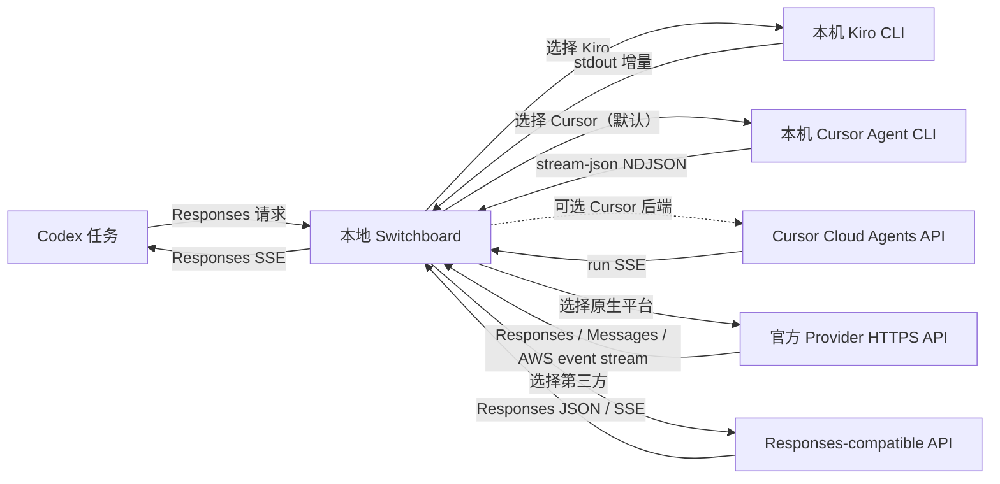

# Codex Provider Switchboard

### 面向 Codex 的本地 AI Provider 反向代理与协议适配器

| [快速开始](#快速开始) | [配置](docs/configuration.md) | [本地 API](docs/api.md) | [架构](docs/architecture.md) | [安全](SECURITY.md) | [贡献](CONTRIBUTING.md) |
| --- | --- | --- | --- | --- | --- |

[English](https://github.com/qaz553286745/codex-provider-switchboard/blob/main/README.md) |
[简体中文](https://github.com/qaz553286745/codex-provider-switchboard/blob/main/README.zh-CN.md)

这是一个运行在本机的 OpenAI Responses 兼容反向代理与控制层。Codex 始终连接
同一个地址，你可以在网页中切换实际使用的 Provider。它不是逐字节透传代理，还会
进行协议转换、流式事件归一化，以及 Codex 任务与上游 Session 的绑定。

- **Kiro CLI**：复用本机已经安装、登录的 `kiro-cli`。
- **Cursor Agent CLI**：默认路径，支持真实 NDJSON 流式输出与本地会话续用。
- **Cursor Cloud Agents**：作为可选 API 后端保留。
- **原生多平台连接**：由 Switchboard 自己实现 Python 客户端，可选择 OpenAI
  API、ChatGPT Codex、Anthropic Claude、GitHub Copilot、xAI、OpenRouter，以及
  实验性的 Kiro 账号直连。
- **第三方 Responses API**：连接用户配置的 HTTPS 网关，直接转发 Responses
  JSON 与 SSE。

它负责 Responses 协议转换、流式事件、模型参数映射，以及 Codex 任务与上游
Session/Agent 的一一对应。

> [!IMPORTANT]
> 这是独立的社区适配器，与 OpenAI、Kiro/AWS、Cursor 没有隶属或官方支持关系。
> 使用前请自行确认各厂家的服务条款、数据处理方式和计费规则。

Provider 代码由本仓库自己维护：不会安装或运行 Pi、
`@mariozechner/pi-ai`、Node Worker 或 Pi Provider 插件。作为可选迁移能力，
只有在用户点击后，Switchboard 才会读取固定的 `~/.pi/agent/auth.json`，把白名单
内可验证的凭据复制到自己的存储中；Pi 只是凭据来源，不是运行时依赖。

计费跟随当前选中的上游：选择 Kiro 时使用 `kiro-cli` 已登录账号的额度，选择
Cursor 时使用 Cursor 账号额度，选择第三方时由第三方计费。Codex 仍负责任务编排
和本地工具执行，但模型推理经 Kiro 转发时不会消耗 OpenAI 模型额度。

## 核心能力

- Codex 固定连接 `http://127.0.0.1:8787/v1`，切换厂家无需修改地址。
- 最终回答和工具执行前的简短进度说明分别使用 Codex `final_answer` 与
  `commentary` 阶段实时输出；真实的 `update_plan` 调用可驱动原生步骤进度，且
  不会暴露隐藏思维链。
- 按 Provider 能力适配 Responses：原生 Codex 平台保留 custom tool、
  `tool_search`、namespace、多智能体事件、血缘请求头与远程压缩；较窄的兼容网关
  会进行可逆的 function 降级与结果还原，转换逻辑不会散落在 Web 路由中。
- 同一个 Codex 任务会续用对应的 Kiro Session 或 Cursor Agent。
- Codex 子 Agent 使用独立 `thread_id`，不会误用主任务的上游会话。
- Kiro、Cursor 和其他 Provider 共用子 Agent 调度熔断：同一轮反复中断、唤醒或
  轮询状态时，本机直接返回可见的终止消息，不再无限消耗上游额度。
- 不同任务使用隔离工作目录；把 `KIRO_MAX_CONCURRENCY` 或
  `CURSOR_CLI_MAX_CONCURRENCY` 从保守默认值 `1` 调高后，可同时运行多个本地 CLI。
- Bridge 会按 Codex 风格批处理工具：优先用一个自定义 exec 调用配合
  Promise.all 执行已知且相互独立的检查；没有 exec 时，仅在
  parallel_tool_calls 允许的情况下合并顶层调用，依赖步骤和冲突写入仍保持串行。
- 推理档位准确传递：
  - Codex `max` / `ultra` 会传给 Kiro `--effort max`；
  - Cursor CLI 使用 `--list-models` 公布的具体档位模型，例如
    `gpt-5.6-sol-max`；
  - Cloud API 只使用 `GET /v1/models` 明确公布的参数和值；
  - 网页会显示最近一次实际使用的模型与参数。
- Cursor API Key 原子写入权限为 `0600` 的本机配置文件，接口永不回显明文。
- 网页直接读取 Kiro `--list-models`、Cursor `/v1/models` 或第三方模型目录。
- 原生平台优先读取官方模型目录；没有公开目录时使用小型、受控的兼容目录。
- 原生平台凭据与普通配置分离：环境变量优先，页面提交的 Key/OAuth Token 原子
  写入独立 `0600` 文件。Switchboard 不读取、复制或覆盖 `~/.codex/auth.json`；
  也不会扫描未列入白名单的 Agent 私有文件。
- Pi 账号支持“先预览、再一键导入”：可映射 Kiro、Cursor、OpenAI/ChatGPT
  Codex、Anthropic、GitHub Copilot、xAI 与 OpenRouter。默认跳过已有凭据，只有
  显式确认才覆盖，接口和日志都不会回显 Token。
- 额度卡片读取 Kiro `/usage`；Cursor 严格按官方 API 能力显示 Key/单次用量并
  链接官方用量页；第三方额度支持端点与 JSON 字段映射。
- Codex 配置接管要求显式确认：完整时间戳备份、字段级应用与恢复；受管字段漂移
  不会锁死关闭，备份丢失时也能保守移除代理路由，并保留 Codex 自动更新的插件、
  市场、桌面及其他字段。
- 网页提供单智能体（推荐默认）、最多 2/4 线程和自定义并发模式。单智能体只写入
  `[agents].enabled = false`，不会关闭终端、文件编辑、浏览器等普通工具。
- Kiro/Cursor 的提示词绝对上限为 4 MiB；超长历史只按完整用户轮次裁剪，Cursor
  CLI 还会根据官方模型名称中的 272K/1M 容量应用更保守的动态预算；当前轮次绝不
  截断，仍超限时返回不会触发重连的终止错误。
- Kiro 的上下文溢出、混合溢出/截断以及 Bridge 输出截断状态都不会再作为
  assistant 回答返回；适配器会新建会话，并按 768 KiB 的恢复上限裁剪旧完整轮次
  后自动重试一次。
- Kiro CLI 不提供可信的单次 Token 数，因此 Kiro 响应不再回报字符数推算值，避免
  错误触发 Codex 自动压缩。
- Codex HTTP 回退原生兼容带大小边界的 gzip、deflate 与 zstd，不改用户的压缩设置。
- 默认只监听回环地址，并具备请求大小限制、输出大小限制、同源控制接口、
  安全响应头和不含提示词/工具正文的脱敏轮转日志。
- 同时支持 Responses SSE 和 Codex 使用的 Responses WebSocket 传输：同一通道
  FIFO、不同命名通道可并发、仅显式 `response.cancel` 才取消对应通道，并以有界
  `previous_response_id` 缓存保持上下文血缘，不会因新请求隐式中断旧请求。

## 数据流



## 环境要求

- Python 3.11 或更高版本。
- 推荐使用 [`uv`](https://docs.astral.sh/uv/)。
- Codex Desktop 或 Codex CLI。
- 使用 Kiro 时：本机已安装并登录 `kiro-cli`。
- 使用 Cursor 时：本机安装 `cursor-agent`，并具备 Cursor User API Key。
- 使用第三方时：具备 Responses 兼容的 HTTPS 地址与 API Key。
- 使用原生平台时：准备所选平台的 API Key，或在网页中完成账号登录。OpenAI、
  Anthropic、xAI、OpenRouter 的 API Key 路径优先作为稳定方案；订阅账号 OAuth
  与 Kiro 直连会明确标记为实验性。
- Pi 不是必需依赖；如果 Pi 已经保存了兼容账号，可以从页面导入，而不启动 Pi、
  不切换当前 Provider。

Kiro 适配器主要面向 macOS 桌面环境，以复用本机 CLI 的登录状态；Python 服务
本身没有绑定 macOS 专属框架。

## 快速开始

在已经克隆的仓库中执行：

```bash
cd codex-provider-switchboard
uv sync --locked --all-groups
uv run codex-provider-switchboard
```

打开 <http://127.0.0.1:8787>。页面会检查 Kiro CLI 与 Cursor CLI 是否可用。
使用 Cursor 时，在页面中粘贴 API Key，保留推荐的本地 CLI 后端，读取官方模型
目录、选择模型、保存并校验后切换 Provider。只有明确需要且账号允许 Cloud Agent
存储时才切换到 `cloud_api`。

API Key 提交后不会再次返回浏览器。默认保存在当前用户的应用配置目录；也可以
使用 `CURSOR_API_KEY` 环境变量，且环境变量优先于配置文件。

第三方 Provider 需要填写 `/responses` 的上一级 Base URL、API Key 与模型 ID；
模型目录和额度路径可选。远程 HTTP、跨域辅助路径、URL 内凭据和重定向都会被拒绝。

原生平台在网页选择厂家后，可保存 API Key 或启动对应账号登录；网页只显示设备码、
认证链接和安全状态，不会读回明文。Cursor 继续使用官方 `cursor-agent`（或可选的
Cloud Agents API），不会内建第三方非官方的 Cursor 内部 RPC 插件。

如果本机 Pi 已经登录，在“原生多平台连接”中先点击“扫描可导入账号”，确认脱敏
预览后再点击“一键导入可用账号”。默认不会覆盖 Switchboard 已有凭据。Cursor
只有在 Pi 中存在明确的 `cursor` 或 `cursor-agent` API Key 记录时才会导入，
Switchboard 不会猜测或扫描其他 Cursor 文件。

## 配置 Codex

网页可以安全接管**用户级** `~/.codex/config.toml`：输入 `ENABLE` 后先创建
时间戳备份，再基于启用瞬间的当前文件只应用连接字段和页面选定的智能体模式；代理
启用期间输入 `APPLY` 可以只更新智能体配置，关闭时输入 `RESTORE`，也只恢复这些
受管字段。代理启用期间 Codex 自动更新的插件、市场、桌面字段和你的其他
编辑都会保留。受管字段发生漂移时，关闭仍会把备份中的受管值合并进当前文件；若
备份丢失或损坏，则只移除仍与接管记录一致的代理路由值，并保留当前模型。若代理
路由已经在网页外被移除，陈旧的“已启用”状态会自动解除，不会阻塞下一次启用。

新接管默认选择“单智能体”，对应 `[agents].enabled = false`。这只隐藏/关闭 Codex
的多智能体工具，终端、文件编辑、浏览器等普通工具仍然可用。选择有限并行、并行或
自定义模式时，页面才会管理 `agents.max_concurrent_threads_per_session`；关闭代理
时，这些键和模型路由一样按字段恢复，不覆盖 `[plugins]`、`[marketplaces]`、
`[desktop]` 等其他内容。

接管期间不会修改 `features.enable_request_compression`。本地 HTTP 回退已经支持
带边界校验的 gzip、deflate 和 zstd JSON 请求体，因此会原样保留你的压缩偏好以及
同一 `[features]` 表中的其他设置。

当前配置使用默认 OpenAI Provider 时，网页会安装独立的
`codex-provider-switchboard` Provider 身份。这是有意的：Codex 会把名称严格等于
`OpenAI` 的 Provider 视为原生支持远程压缩，但同一个 Switchboard 地址此时可能
切到 Kiro 或 Cursor。独立身份会让这些 Bridge 路径使用 Codex 的本地摘要，避免
发送其无法满足的 `compaction_trigger`。选择 OpenAI 原生直连，或把第三方网关
显式设为 `native_codex` 时，则可以使用能力门控的 `/responses/compact` 转发。
当前已经选择非保留的自定义 Provider 时，仍会保留该 Provider ID，仅临时接管其
连接表。

最小手工配置是：

```toml
model = "gpt-5.6-sol"
model_provider = "codex-provider-switchboard"

[model_providers.codex-provider-switchboard]
name = "Local Codex Provider Switchboard"
base_url = "http://127.0.0.1:8787/v1"
wire_api = "responses"
requires_openai_auth = false
supports_websockets = true
request_max_retries = 0
stream_max_retries = 0
```

不要改写成 `openai_base_url`：当前 Codex 会因此把回环适配器判断成原生 OpenAI
Provider，即使当前上游是 Kiro、Cursor 或其他非原生网关也会启用远程压缩。远程
鉴权或直接第三方配置可参考
[`demo_config.toml`](demo_config.toml)。

修改后新建或重启 Codex 任务。当前 Codex 会出于安全原因忽略项目级
`.codex/config.toml` 中的 `model_provider` 与 `model_providers`，所以 Provider
必须配置在用户级文件。参考官方
[Codex 配置基础](https://learn.chatgpt.com/docs/config-file/config-basic)和
[配置参考](https://learn.chatgpt.com/docs/config-file/config-reference)。

如果确实要监听非回环地址，服务会强制要求 `SWITCHBOARD_TOKEN`。同时在上述
Provider 配置中增加：

```toml
env_key = "SWITCHBOARD_TOKEN"
```

不要把 Token 明文写进 TOML。

## 健康检查

以下请求不会调用上游 Provider：

```bash
curl --fail http://127.0.0.1:8787/health
curl --fail http://127.0.0.1:8787/v1/models
```

下面的请求会真实调用当前选中的 Provider：

```bash
curl --no-buffer http://127.0.0.1:8787/v1/responses \
  -H 'Content-Type: application/json' \
  -d '{"model":"gpt-5.6-sol","input":"只回复 OK","stream":true,"reasoning":{"effort":"max"}}'
```

如需查看后续 Codex 请求的结构而不记录提示词或工具载荷，可以这样启动并跟踪脱敏
日志：

```bash
SWITCHBOARD_DEBUG_REQUESTS=1 KIRO_MAX_CONCURRENCY=2 uv run codex-provider-switchboard
tail -f "$HOME/Library/Application Support/codex-provider-switchboard/logs/switchboard.log"
```

其中 `top_level_tool_count` 是顶层 `tools` 数量，`effective_tool_count` 还包括
`additional_tools`；因此即使前者为 `0`，Codex 仍可能实际提供了工具。

## 会话映射如何工作

Switchboard 优先读取 `client_metadata.thread_id`，缺失时才使用
`prompt_cache_key`。这个值会先经过 SHA-256，再作为本机目录和锁的键。

只有当本次输入的指纹序列严格以前一次成功提交的序列开头时，才会复用会话并只
转发新增内容。Responses WebSocket 模式会先用连接内的
`previous_response_id` 状态把 Codex 的增量输入还原成这个完整逻辑序列，并恢复
instructions 与工具目录。随后即使会话复用把逻辑历史缩减为仅新增 input，工具目录
仍会从完整逻辑请求中重新物化，较早的 `additional_tools` 不会在续接提示中退化成
误导性的 `tools: []`。因此：

- 同一 Codex 任务会复用同一个 Kiro Session / Cursor Agent；
- 主任务和子 Agent 的 `thread_id` 不同，映射自然隔离；
- 上下文被替换或压缩后不匹配，会安全地新建上游会话；
- 续用的 Kiro Session 一旦出现旧 nonce 或嵌套 Bridge 协议污染，会立即删除映射，
  并用完整请求自动重试一次全新的 Kiro Session；
- Kiro 返回上下文溢出、混合溢出/截断或 Bridge 输出截断状态时不会把它显示成
  回答，而是清除旧映射、按恢复上限裁剪完整旧轮次并自动重试一次；
- Cursor 模型或参数变体变化后，会使用不同的 Agent 映射。

映射文件只保存上游会话 ID、输入/输出项目的 SHA-256 指纹和更新时间，不保存
提示词正文。Kiro 与 Cursor 自身仍可能保存会话数据，请结合其官方保留策略评估。

## Cursor 适配器的重要区别

默认后端会在受控的 Bridge 工作区中，以非交互 Agent 生成模式启动
`cursor-agent`；其原生 Shell、Read、Write 与 MCP 权限全部拒绝，真正的工具执行和
审批仍由外层 Codex 负责。Prompt 只通过 stdin 发送，适配器读取受大小限制的
`stream-json`，并把每个 Codex 任务映射到返回的 Cursor CLI Session。可选 Cloud
后端继续使用持久化 Agent/run API 与 run-scoped SSE。两条路径都不会绕过 Cursor
的授权、计费、安全控制或产品策略。

官方说明：[Cursor CLI](https://docs.cursor.com/en/cli/overview)、
[Cloud Agents API](https://cursor.com/cn/docs/cloud-agent/api/endpoints)。

## 安全边界

- 默认绑定 `127.0.0.1`；没有 `SWITCHBOARD_TOKEN` 时拒绝非回环监听。
- Cursor CLI 通过官方 `CURSOR_API_KEY` 环境变量接收密钥，并固定连接
  `https://api2.cursor.sh`；可选 Cloud 后端只允许连接 `https://api.cursor.com`。
- 第三方 Key 只发送至用户明确配置的 HTTPS Origin；模型与额度路径必须同源，
  客户端不跟随重定向。
- Kiro 与 Cursor CLI 提示词都走 stdin，不进入进程参数。
- Cursor 内层 CLI 使用默认 Agent 生成模式，避免 Ask 模式拒绝写操作委派；同时在
  独立沙箱工作区通过项目权限禁止其原生 Shell、Read、Write 与 MCP，实际工具仍
  只由外层 Codex 执行，用户无需在 Cursor 中手动切模式。
- 日志只记录字段结构、数量和哈希，不记录提示词、工具载荷或密钥；日志保存在
  当前用户应用数据目录，按大小轮转，并脱敏凭据、Bridge nonce 和会话型标识。
- 控制接口不开放 CORS，写操作检查同源；回环模式会拒绝非回环 Host，降低 DNS
  rebinding 风险。
- 文件型 API Key 依赖文件权限，不等同于 macOS Keychain。宿主用户账户属于信任
  边界。

完整说明见 [SECURITY.md](SECURITY.md)。

## 代码结构

```text
.
├── src/codex_provider_switchboard/
│   ├── compatibility/   # Provider 能力画像与可逆 Responses 适配
│   ├── domain/          # Responses 转换与严格 Bridge 协议
│   ├── application/     # Provider 路由、状态与脱敏检查器
│   ├── infrastructure/  # 配置、会话、子进程与 HTTP 客户端
│   ├── providers/       # Kiro / Cursor / 原生平台 / 第三方适配器
│   ├── web/             # FastAPI 与本地静态控制页面
│   └── runtime.py       # 依赖组合入口
├── tests/               # Mock 单元测试与 HTTP 集成测试
├── docs/                # 架构、配置与 API 契约
├── examples/            # 完全脱敏的用户配置示例
├── scripts/             # 仓库与发布包安全检查
└── pyproject.toml        # 打包、代码质量与测试策略
```

进一步阅读：

- [架构与请求流](docs/architecture.md)
- [配置参考](docs/configuration.md)
- [本地 HTTP API](docs/api.md)
- [贡献指南](CONTRIBUTING.md)

## 开发与验证

```bash
uv sync --locked --all-groups
uv run ruff check .
uv run ruff format --check .
uv run python scripts/check_repository.py
uv run pytest --cov
uv run python scripts/build_release.py --python 3.11 --allow-dirty
```

发布维护者还应阅读[中文发布指南](https://github.com/qaz553286745/codex-provider-switchboard/blob/main/RELEASING.zh-CN.md)
或 [English release guide](https://github.com/qaz553286745/codex-provider-switchboard/blob/main/RELEASING.md)。

测试全部使用 Fake/MockTransport，不会读取真实 Cursor Key，也不会产生真实 API 用量。

## 当前限制

- 实现的是 Codex 所需的 Responses 行为，不是完整通用的 OpenAI API 服务。
- Provider 是进程级选择；已开始的请求不会中途切换，后续请求读取最新选择。
- 新建或续接会话的最终文本，以及工具执行前的简短进度说明，都可分别按 Codex
  `final_answer`、`commentary` 阶段实时增量输出；工具调用仍须完整校验后再输出。
  只有上游模型实际调用 `update_plan` 时，Codex 才显示原生步骤进度；Switchboard
  不伪造隐藏推理或计划状态。
- 已支持 Codex 的 Responses WebSocket 模式；不实现无关的 Realtime 音频 API。
- 仅 `native_codex` 的原生直连/第三方 Provider 会转发远程压缩；Kiro、Cursor、
  Prompt Bridge 与 function-only 网关会明确拒绝，并应使用上面的独立 Provider
  配置走本地摘要。
- Cursor CLI 与 Cloud Agents API 都不提供账户剩余额度；页面会明确标注该边界，
  验证当前后端，在可用时显示最近运行 Token，并链接 Cursor 官方用量页。
- 上游 CLI/API 可能变化，需要持续跟进官方协议。

## License

[MIT](LICENSE)
