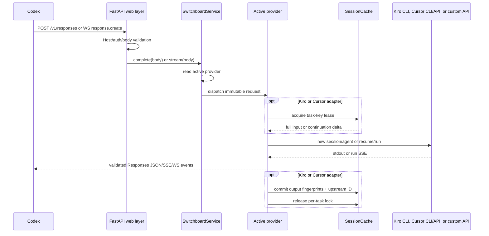

# Architecture

Codex Provider Switchboard follows a ports-and-adapters layout. The design goal
is to keep protocol translation testable without starting a server, process, or
real provider request.

## Layers

| Layer | Responsibility | May depend on |
| --- | --- | --- |
| `compatibility` | provider capability profiles, Responses tool lowering/restoration, SSE framing | standard library |
| `domain` | Responses objects, SSE events, bridge envelopes, task-key hashing | standard library |
| `application` | active-provider routing, capabilities, readiness, safe status, inspection | compatibility, domain, provider ports |
| `providers` | Kiro/Cursor workflows, native direct adapters, custom Responses relay | compatibility, domain, infrastructure ports |
| `infrastructure` | filesystem/backup state, CLI subprocesses, HTTP/SSE/event-stream clients | compatibility and domain models where required |
| `web` | authentication, origin/Host checks, JSON limits, HTTP/WebSocket responses, UI | application |
| `runtime.py` | dependency construction | every concrete adapter |

FastAPI does not know whether Cursor uses a local process or the Cloud Agents
API. `CursorCliRunner` and `CursorClient` do not know what a Responses event
looks like. This separation lets each boundary be tested with a fake runner or
`httpx.MockTransport`.

## Request flow



Provider choice is sampled once at request start. A dashboard change therefore
affects subsequent requests without mutating an in-flight stream.

## Responses compatibility boundary

The compatibility boundary follows the same useful separation found in mature
API gateways such as [`sub2api`](https://github.com/Wei-Shaw/sub2api): normalize
the client contract, execute one provider transport, then restore the client
contract. Switchboard implements that design independently in Python and does
not import or execute `sub2api`.
Provider-specific rewrites do not live in FastAPI routes or in the scheduler.

| Profile | Used by | Request behavior |
| --- | --- | --- |
| `native_codex` | OpenAI API, ChatGPT Codex, explicitly opted-in custom gateways | Preserve native custom tools, `tool_search`, namespaces, multi-agent fields, lineage headers, and remote compaction |
| `function_only` | xAI, OpenRouter, GitHub Copilot, default custom gateways | Lower client custom/discovered/namespaced tools to deterministic functions and restore their Responses item/event shapes |
| `prompt_bridge` | Kiro, Cursor, Anthropic bridge paths | Render the effective tool catalog into a nonce-protected prompt and accept only one fully validated result envelope |

The effective tool catalog is assembled from top-level `tools`, Codex
`additional_tools` input items, and completed `tool_search_output` discovery
items. Namespace names are flattened collision-safely only for providers that
need function lowering, and are restored before Codex sees the call. Custom-tool
and tool-search arguments are buffered until a complete JSON value is available;
partial internal function syntax is never emitted as client SSE.

Continuation validation covers function, custom, local-shell, tool-search, MCP,
and `item_reference` items. A stateless provider may drop a foreign
`previous_response_id` only when every new tool output has matching call context;
otherwise the request fails explicitly instead of corrupting the tool chain.
Native profiles retain the original namespace and discovery shapes and forward
only an allow-list of Codex lineage headers. Native multi-agent requests add the
official `responses_multi_agent=v1` beta token while preserving any unrelated
caller beta tokens.

`POST /v1/responses/compact` is routed only to native profiles. Explicit compact
requests are rejected in hosted multi-agent mode because each hosted agent owns
and compacts its own context. Prompt-bridge and function-only routes continue to
use Switchboard's bounded local history reduction and never forge an opaque
native `compaction` item.

## Bridge protocol

Kiro CLI and Cursor Agent receive a prompt containing the Responses request and
a random nonce. They are instructed to produce exactly one envelope:

```text
CODEX_SWITCHBOARD_BRIDGE_BEGIN_<nonce>
{"kind":"message","text":"..."}
CODEX_SWITCHBOARD_BRIDGE_END_<nonce>
```

or a validated tool-call envelope with a short user-visible progress update:

```text
CODEX_SWITCHBOARD_BRIDGE_BEGIN_<nonce>
{"kind":"tool_calls","commentary":"I will inspect the configuration first.","calls":[...]}
CODEX_SWITCHBOARD_BRIDGE_END_<nonce>
```

The nonce makes accidental marker collisions unlikely. Final message text is
emitted with Responses `phase=final_answer`. A tool round's `commentary` JSON
string is decoded incrementally and emitted with `phase=commentary`; it is a
concise action update, not hidden chain-of-thought or a synthesized reasoning
summary. Tool calls are held until the complete envelope can be checked against
the request's tool catalog.

The bridge also carries a compact tool-scheduling policy. It asks the upstream
model to minimize inference round trips by batching already-known independent
operations. When Codex exposes its custom exec orchestrator, one exec call can
await independent nested tools with Promise.all, even when the Responses
request disallows multiple top-level calls. Without exec, independent top-level
calls are grouped only when parallel_tool_calls permits it. Dependencies,
conflicting writes, destructive actions, and separate approval-sensitive
actions remain sequential. Switchboard never executes Codex tools itself; Codex
retains tool execution, sandbox, and approval ownership.

All bridge markers are control data, including markers carrying an older nonce.
The streaming decoder retains only the longest trailing substring that could
still become a bridge-marker prefix across an upstream chunk boundary, and
releases all other text immediately. Nested,
duplicate, stale, incomplete, or malformed envelopes fail closed. Normal
message text from both new and resumed Kiro sessions streams as soon as the
decoder proves that fragment is not control data. Protocol contamination before
visible output deletes that task's mapping and replays the complete request once
in a fresh Kiro session; after visible output, the interrupted stream fails
terminally instead of replaying duplicate text.
Tool-call events are never emitted until the full JSON envelope and every tool
name/payload have passed validation.

When Codex advertises `update_plan` and the work has several dependent steps,
the bridge asks the upstream model to maintain that real tool-backed plan. The
Codex UI can then render its native current-step indicator. Switchboard does not
invent a step count when the tool is absent or the upstream model does not call
it.

When session affinity reduces a resumed request to only its new input suffix,
the bridge still builds the tool catalog from the reconstructed full logical
request. This preserves `additional_tools` entries that Codex sent before the
suffix and prevents the upstream model from seeing a misleading empty catalog.

Before a new Kiro or local Cursor session is created, the bridge removes
transport-only IDs/status fields, annotations/logprobs, opaque encrypted
reasoning payloads, and duplicate `additional_tools` entries. If the rendered
prompt is still over the configured limit, it drops only the oldest complete
user-turn groups and records content-free truncation metadata in the bridge
request. Continuation deltas and the newest user turn are never trimmed. If the
active turn itself cannot fit, the adapter emits the terminal Responses error
code `invalid_prompt` without invoking the upstream CLI.

The protocol is a compatibility mechanism, not a security sandbox. Outer Codex
still resolves and approves returned tools. The selected upstream product keeps
its own execution and safety model.

The custom provider already speaks Responses, so it bypasses the bridge
envelope and relays bounded JSON/SSE directly. It removes local-only
`client_metadata`, optionally pins the configured model, and does not maintain
an extra session map.

## Session affinity

The mapping algorithm is intentionally conservative:

1. Prefer `client_metadata.thread_id`; fall back to `prompt_cache_key`.
2. Hash the key with SHA-256 before using it as a directory name.
3. Acquire one asynchronous lock for that digest.
4. Normalize input items and compare their SHA-256 fingerprints with the last
   successfully committed sequence.
5. Resume only when the previous sequence is an exact prefix of the new input.
6. Send only the suffix to an existing upstream session.
7. Commit the current input fingerprints, returned output fingerprints, and
   upstream session/agent ID atomically.

Codex currently gives a main task and each subagent different metadata thread
IDs even when an agent tree shares another cache key. Preferring the metadata
thread ID prevents a subagent from resuming its parent's Kiro session.

Before provider dispatch, the service examines only the active turn's typed
tool-call metadata for repeated subagent control cycles. A new user message or
substantive non-control call resets the observation window. One deliberate
interrupt/restart correction remains valid; repeated
`interrupt_agent -> followup_task -> interrupt_agent` cycles, identical mutating
control calls, or sustained `list_agents` polling produce a local
`response.completed` message instead of another upstream inference. This guard
is shared by HTTP and WebSocket transports and never logs tool payloads or raw
agent names.

Cursor adds both the selected backend and model/parameter fingerprint to its
mapping key. Switching between CLI and Cloud API, or changing a model variant,
therefore creates an independent mapping.

If Kiro reports no output while resuming, the provider retries once with the
complete request in a fresh session. Cursor does the same for stale Cloud agent
IDs (`404`/`410`) and recognizable missing local CLI chat IDs.
If Kiro emits a context-overflow, mixed overflow/truncation, or truncated Bridge
status, the streaming parser withholds every possible status prefix until it can
classify the complete output. The provider clears the mapping and retries once
with older complete turns trimmed to the configured recovery bound. A repeated
status produces a terminal Responses failure. Responses omit usage when the
upstream does not report real tokens; bridge character counts are not a valid
replacement.

## State and concurrency

- `ConfigStore` uses a process-local reentrant lock and atomic replace.
- `SessionCache` serializes requests per task key but permits different tasks to
  progress concurrently.
- `KiroRunner` adds a configurable global semaphore because local CLI processes
  are relatively expensive. Per-task locks allow parallel tasks, while
  `KIRO_MAX_CONCURRENCY` controls how many actually enter Kiro simultaneously.
- `CursorCliRunner` serializes local processes by a configurable semaphore,
  bounds every NDJSON line/stream, and caches the CLI model catalog.
- The optional Cloud `CursorClient` serializes model-catalog cache refreshes.
- `CustomResponsesClient` pins auxiliary paths to the configured origin,
  refuses redirects, and bounds catalog, quota, JSON, and SSE payloads.
- `CodexConfigManager` serializes takeover/restore, stores a verified complete
  backup plus the exact managed-field set (including individual table keys),
  and restores those fields into the latest live TOML so unrelated automatic
  updates survive. Managed-field drift never creates an enable/disable deadlock:
  externally removed routing self-reconciles, while a missing backup falls back
  to removing only recorded routing values that still match. Default takeover
  uses a dedicated provider whose display
  name is not `OpenAI`; this prevents Codex from inferring native remote
  compaction support while Kiro/Cursor prompt bridges are selected.
- The WebSocket adapter decodes only complete JSON SSE records from providers
  before emitting one JSON text frame per Responses event.
- WebSocket routing and lineage are independent: `stream_id` selects a FIFO
  lane, while `previous_response_id` selects cached response state. The default
  lane and each named lane never self-overlap; distinct named lanes may run in
  parallel up to the connection-wide 16-response limit. Named events echo their
  stream ID, and no `response.create` implicitly cancels another response.
- The WebSocket adapter retains a byte- and count-bounded LRU of response states
  per connection. Matching `previous_response_id` turns are reconstructed from
  the prior request, prior output, and new input before fingerprint/session
  routing; this allows branching lineage, while evicted IDs fail explicitly
  instead of silently losing context.
- `response.cancel` is an explicit lane-local interruption. Connection teardown
  cancels all active and queued work and deterministically reaps receive, lane,
  and provider tasks, so no provider process survives a disconnected client.
- Both HTTP SSE and WebSocket transports recognize `response.completed`,
  `response.failed`, `response.incomplete`, and `error` as terminal. Once a
  stream has started, malformed JSON, truncated records, provider exceptions,
  and premature EOF become a terminal `response.failed` instead of a bare
  disconnect that Codex could retry indefinitely.
- Provider selection is snapshotted when a WebSocket request enters its lane;
  later dashboard changes affect only newly accepted requests.
- Native `compaction_trigger` input and `/responses/compact` are accepted only
  for a `native_codex` upstream. Other profiles reject them before provider
  dispatch; the managed non-OpenAI identity prevents normal Kiro/Cursor tasks
  from selecting that protocol accidentally.
- WebSocket `generate: false` prewarm is completed locally and installed as
  connection-local cached state, so a prewarm never starts a duplicate
  Kiro/Cursor inference.
- The HTTP adapter accepts identity, gzip, deflate, and zstd request bodies,
  enforcing the configured limit both before and during decompression.
- The inspector stores one redacted metadata snapshot under a lock.
- A permission-restricted rotating handler persists content-free operational
  history after applying credential, bridge-marker, and identifier redaction.

Run a single server process. The on-disk operations are atomic, but the
in-memory locks and active-provider inspector are intentionally process-local.

## Native direct providers

The `direct` provider is implemented entirely in this repository. Its catalog
fixes platform origins, protocol families, authentication modes, and default
models. Infrastructure clients implement Responses SSE, Anthropic Messages SSE,
AWS event-stream decoding for experimental Kiro direct mode, bounded model
catalog requests, and normalized quota data. Domain translators convert only
the public Responses request and tool shapes required by Codex.
Kiro's narrower tool-name grammar is handled with deterministic, collision-safe
aliases of at most 64 characters. Codex namespace and wire names are restored
on returned tool calls and reused consistently in tool-result continuations.
Kiro Direct also advertises a collision-safe internal final-answer tool whose
description carries the terminal-action contract without modifying the user's
message. Plain assistant text is treated as commentary until Kiro either calls
a real Codex tool or submits its outcome and answer through that internal tool.
All three semantic outcomes produce a protocol-complete final message;
`blocked` and `failed` are visibly labeled for the user but are not represented
as transport failures. A real upstream/protocol failure still produces
`response.failed`. This distinction prevents Codex from presenting a valid
agent status as `stream disconnected before completion`.

When a Codex custom `exec` tool result contains a `session_id` without a numeric
`exit_code`, Switchboard emits a safe client-owned `write_stdin` tool call before
asking Kiro for another action. Polling repeats until the command exits. The
original command is never relaunched, and a discarded handle such as
`exit_code=undefined` is called out in the direct-provider guidance. A
plain-text EOF receives one bounded corrective continuation; a repeated
incomplete EOF is reported as a terminal failure instead of a false successful
completion.

Codex inter-agent `agent_message` items are normalized separately from ordinary
messages. A trailing `NEW_TASK` envelope is a hard current-turn boundary, and
its delegated payload is extracted only from that item type. This prevents a
forked Kiro Direct child from resuming an inherited parent task; opaque
`reasoning.encrypted_content` is never treated as prompt text. `FINAL_ANSWER`
envelopes are preserved as labeled child results for the parent.

There is no Pi package, Node worker, plugin loader, or Pi provider subprocess in
this path. External projects were used as interoperability research only. The
optional Pi integration is a local credential-source adapter, not a provider:
it parses an allow-listed subset of Pi's fixed auth-file schema only when the
user requests a preview or import.
Cursor is intentionally not in this catalog: its supported paths remain the
official local CLI and optional Cloud Agents API because unofficial internal
RPC adapters would broaden the security and compatibility boundary.

Authentication is separate from ordinary settings. `credentials.json` is
locked, written atomically, symlink-resistant, and never serialized to the
control plane. The web layer receives only configured/source/type/expiry
metadata. OAuth login sessions are bounded, retained briefly in memory, and
cancelled during application shutdown. A second login request for the same
platform reuses its active session. Switchboard never reads Codex's
`~/.codex/auth.json`, Kiro CLI storage, or Cursor application storage. The
optional Pi importer reads only `~/.pi/agent/auth.json`, rejects caller-provided
paths and unsafe file metadata, never serializes secret values, and writes valid
copies through the same atomic Switchboard stores. Existing values are skipped
by default, and an environment credential cannot be overwritten.

## Stored data

| Location | Contents | Permission target |
| --- | --- | --- |
| `config.json` | provider settings, optional keys, models, quota mapping | `0600` |
| `credentials.json` | direct-provider API keys and OAuth refresh state | `0600` in a `0700` directory |
| `config.toml.switchboard-backup-*` | exact pre-takeover Codex config | `0600` |
| `runtime/**/.bridge-session.json` | upstream ID, item hashes, timestamp | `0600` |
| `logs/switchboard.log*` | redacted bounded operational history | `0600` in a `0700` directory |
| Kiro work directories | data created by Kiro CLI | application-owned `0700` directories |
| Cursor CLI work directory | local CLI session/runtime data | application-owned `0700` directory |

Switchboard mapping files do not store prompt text. Provider products may keep
their own session history independently.

## Adding a provider

1. Add a transport in `infrastructure/` if one is needed.
2. Implement `ResponsesProvider` in `providers/`.
3. Give the provider a distinct session-cache namespace.
4. Register it in `runtime.py` and extend validated provider IDs/configuration.
5. Add mocked unit and HTTP integration tests.
6. Update both READMEs, configuration docs, the dashboard, and the changelog.

Do not add provider branches to FastAPI routes.
